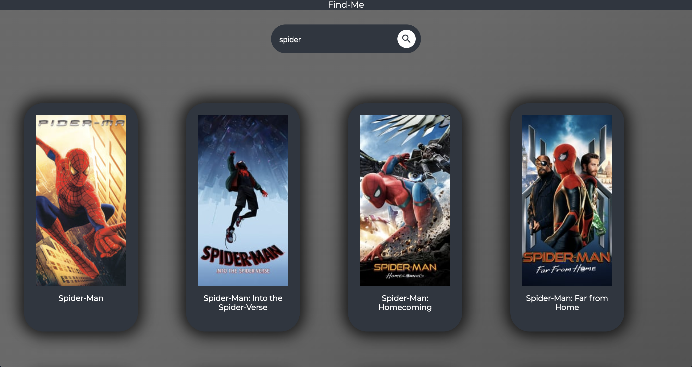

# Find Me

Find Me is a movie finder application that searches the MovieDB (https://www.themoviedb.org/) api and returns all results based on any given query.

The name was inspired by another generic project name that I choose for a movie recommendation system (https://www.github.com/arvind-maan/reco-me).

This project is intended to be the first of many in order to further my understanding of React and JavaScript.

The above screenshot shows the website after searching "spider", at the bottom of the page there is pagination (so you can flip through multiple pages of results).
